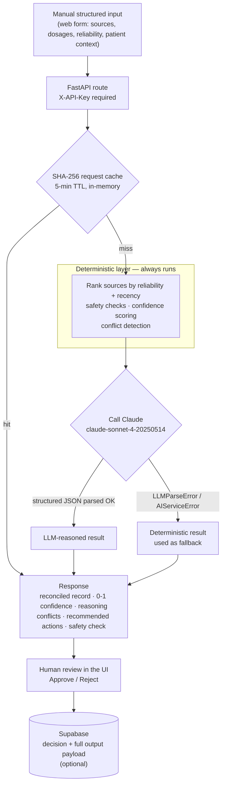

# Clinical Data Reconciliation Engine

A prototype that reconciles conflicting medication records pasted in from multiple sources, and scores patient-record data quality — with a deterministic rule engine as the floor and Anthropic Claude layered on top for clinical reasoning.

The design question it answers: **where do you draw the line between a rule you can audit and a model you cannot?** Here, the deterministic reconciler always runs and always produces a complete answer. The LLM is an enhancement that can fail without taking the endpoint down.

---

## ⚠️ Scope and safety boundary

Read this before anything else.

This is a **take-home assessment prototype**, built in roughly 18 hours. It is explicitly **not**:

| Not | Why it matters |
|---|---|
| Clinically validated | No clinician review, no trial, no evidence of correctness on real cases |
| HIPAA compliant | No BAA, no audit controls, no encryption-at-rest guarantees, no access logging |
| EHR-integrated | Records are typed into a web form by hand. Nothing is read from or written back to any EHR |
| FHIR / HL7 connected | No healthcare interchange format is parsed or emitted |
| A patient record system | Only approve/reject decisions are persisted. There is no durable patient store and no reconciliation history per patient |
| Autonomous | Nothing acts on its own. Every result is presented to a human who approves or rejects it |
| Production-ready | Static API key auth, single-instance in-memory cache, no tenancy, no rate limiting |

Every example in this README uses **fictional, synthetic patient data**. Do not put real patient information into this application.

---

## Live Demo

A demo deployment of the frontend is at https://clinical-reconciliation.vercel.app — it exercises the same UI against a separately hosted backend. Availability is not guaranteed; run it locally (below) for a reliable walkthrough.

| Route | URL |
|---|---|
| Medication Reconciliation | https://clinical-reconciliation.vercel.app/reconcile |
| Data Quality Validation | https://clinical-reconciliation.vercel.app/validate |

---

## How it works



The deterministic result is computed **before** the model is called, not as an error handler bolted on afterwards. If Claude is unavailable, returns malformed JSON, or the API key is missing, the endpoint still answers — with a traceable, rule-derived reconciliation rather than a 500.

---

## Tech Stack
- **Frontend**: React, Vite, Tailwind CSS, deployed on Vercel
- **Backend**: FastAPI (Python), deployed separately
- **Database**: Supabase (PostgreSQL) — stores approval/rejection decisions with full AI output payload
- **AI**: Anthropic Claude (claude-sonnet-4-20250514)

---

## Features

- **Medication reconciliation** — enter records from several sources by hand, labelling each with its origin (Hospital EHR, Clinic, Pharmacy, Patient Portal) and a reliability level; get one reconciled medication back with the reasoning behind it. The labels are user-supplied metadata, not live connections to those systems
- **Patient data quality validation** — score a patient record across completeness, accuracy, timeliness, and clinical plausibility; surface specific issues with severity levels
- **Confidence scoring** — every reconciliation result includes a 0–1 confidence score visualised as a ring chart
- **Approve / Reject workflow** — a human reviewer approves or rejects each suggestion; the decision and the full model output payload are persisted to Supabase and reflected as live counters in the navbar. Nothing is acted on without this step
- **In-memory response cache** — a plain dict keyed by the SHA-256 of the request body, evicting on a 5-minute TTL. Identical requests skip the LLM entirely. Process-local and lost on restart
- **API key authentication** — all backend routes require an `X-API-Key` header

---

## Repository structure

```
clinical-reconciliation/
├── backend/                  # FastAPI app (port 8080)
│   ├── main.py               # App entry point, middleware, CORS
│   ├── api/routes/           # reconcile.py, validate.py
│   ├── core/                 # Reconciler, quality scorer, caching
│   ├── llm/                  # Anthropic client, prompt templates, parser
│   ├── schemas/              # Pydantic request/response models
│   ├── config.py             # Env var loading via python-dotenv
│   └── tests/                # 55 pytest tests (unit + integration)
├── frontend/                 # React SPA (port 3000 prod / 5173 dev)
│   ├── src/pages/            # ReconcilePage, ValidatePage
│   ├── src/components/       # Navbar, forms, result cards, shared UI
│   ├── src/hooks/            # useApproval (Supabase-backed)
│   ├── src/lib/supabase.js   # Supabase client
│   └── vercel.json           # Vercel build config and SPA rewrite rules
├── docker-compose.yml        # Orchestrates backend + frontend
└── .env.example              # Root env template
```

Backend and frontend run on a shared Docker bridge network. In production the frontend is served by nginx, which also proxies `/api/*` requests to the backend.

---

## Vercel Deployment

In the Vercel dashboard, set Root Directory to `frontend/` before deploying.

---

## Quick Start with Docker

The fastest way to run the full stack. You only need Docker installed.

**1. Clone the repo**
```bash
git clone <repo-url>
cd clinical-reconciliation
```

**2. Set environment variables**
```bash
cp .env.example .env
# Edit .env and fill in ANTHROPIC_API_KEY and API_KEY
```

**3. Build and run**
```bash
docker compose up --build
```

| Service  | URL                        |
|----------|----------------------------|
| Frontend | http://localhost:3000       |
| Backend  | http://localhost:8080       |
| API docs | http://localhost:8080/docs  |

To stop: `docker compose down`

---

## Manual Setup (without Docker)

**Prerequisites**
- Python 3.11+
- Node.js 20+

### Backend

```bash
cd backend
python -m venv venv
source venv/bin/activate        # Windows: venv\Scripts\activate
pip install -r requirements.txt

cp ../.env.example ../.env      # fill in your keys
uvicorn main:app --host 0.0.0.0 --port 8080 --reload
```

### Frontend

```bash
cd frontend
npm install

# Create frontend/.env
# Use 127.0.0.1 instead of localhost to avoid IPv6 resolution issues on macOS
echo "VITE_API_BASE_URL=http://127.0.0.1:8080" > .env
echo "VITE_API_KEY=your-api-key" >> .env
# Optional — add VITE_SUPABASE_URL and VITE_SUPABASE_ANON_KEY for the approve/reject counter

npm run dev
# Runs at http://localhost:5173
```

---

## Environment Variables

| Variable                 | Description                                              | Required |
|--------------------------|----------------------------------------------------------|----------|
| `ANTHROPIC_API_KEY`      | Anthropic API key for Claude access                      | Yes      |
| `API_KEY`                | Secret key clients must send in `X-API-Key` header       | Yes      |
| `PORT`                   | Backend port (default `8080`)                            | No       |
| `CORS_ORIGINS`           | Comma-separated allowed origins for CORS                 | No       |
| `VITE_API_BASE_URL`      | Backend base URL used by the React app                   | Yes (FE) |
| `VITE_API_KEY`           | Default API key pre-filled in the frontend UI            | No       |
| `VITE_SUPABASE_URL`      | Supabase project URL for approve/reject persistence      | No       |
| `VITE_SUPABASE_ANON_KEY` | Supabase anon key                                        | No       |

---

## API Endpoints

| Method | Path                          | Description                                      |
|--------|-------------------------------|--------------------------------------------------|
| `POST` | `/api/reconcile/medication`   | Reconcile conflicting medication records via LLM |
| `POST` | `/api/validate/data-quality`  | Score and validate a patient data record via LLM |
| `GET`  | `/health`                     | Health check                                     |
| `GET`  | `/docs`                       | Interactive Swagger UI (FastAPI auto-generated)  |

All routes require the `X-API-Key: <your-key>` header. Missing or invalid key returns `401`.

**Example — reconcile request and response:**
```bash
curl -X POST http://localhost:8080/api/reconcile/medication \
  -H "Content-Type: application/json" \
  -H "X-API-Key: your-api-key" \
  -d '{
    "patient_context": { "age": 67, "conditions": ["Type 2 Diabetes"] },
    "sources": [
      { "system": "Hospital EHR", "medication": "Metformin 1000mg twice daily", "source_reliability": "high" },
      { "system": "Pharmacy", "medication": "Metformin 500mg twice daily", "source_reliability": "medium" }
    ]
  }'
```

```json
{
  "reconciled_medication": "Metformin 500mg twice daily",
  "confidence_score": 0.82,
  "reasoning": "Pharmacy record is most recent...",
  "sources_analyzed": ["Hospital EHR", "Pharmacy"],
  "conflicts_found": [
    "Hospital EHR vs Pharmacy: \"Metformin 1000mg twice daily\" vs \"Metformin 500mg twice daily\""
  ],
  "recommended_actions": ["Verify current dosing with prescriber"],
  "clinical_safety_check": "PASSED"
}
```

---

## Supabase Setup (Optional)

The approve/reject workflow persists decisions to Supabase and shows live counters in the navbar. Skip this if you don't need persistence.

**1. Create the table** — run this in your Supabase SQL editor:

```sql
create table decisions (
  id           uuid        primary key default gen_random_uuid(),
  record_id    text,
  patient_name text,
  decision     text        not null check (decision in ('approved', 'rejected')),
  page         text,
  payload      jsonb,
  created_at   timestamptz not null default now()
);

alter table decisions disable row level security;
```

**2. Enable Realtime** — in the Supabase dashboard go to Database → Replication and toggle on the `decisions` table.

**3. Add env vars** to `frontend/.env`:
```
VITE_SUPABASE_URL=https://<your-project>.supabase.co
VITE_SUPABASE_ANON_KEY=<your-anon-key>
```

Without these vars the app still loads and works — the counters just show 0.

---

## Running Tests

```bash
cd backend
source venv/bin/activate
pytest tests/ -v
```

The suite has **55 tests, all passing** (verified in this workspace with `pytest tests/ -q`). Coverage:
- Input validation (missing fields, invalid enums, empty arrays)
- Auth middleware (missing key, wrong key, valid key)
- LLM client retry logic and error handling
- Response parser (malformed JSON, missing keys)
- In-memory cache (hit/miss, TTL expiry)
- Quality scorer deterministic rules
- Route integration tests with mocked LLM responses

---

## Design Decisions

**Why Anthropic Claude?**
Claude produces well-structured JSON reliably when instructed, handles nuanced clinical reasoning, and the `claude-sonnet` model balances quality and latency. The SDK's async support integrates cleanly with FastAPI's async route handlers.

**Why FastAPI?**
FastAPI gives automatic OpenAPI docs, native async, and Pydantic v2 validation in one package. For an API-only backend without heavy ORM requirements, it's the right weight — fast to write, easy to test, easy to read.

**Deterministic-first approach**
The quality scorer runs rule-based checks (physiologically impossible vitals, stale dates, empty allergy lists) before calling the LLM. This means common issues are caught instantly without an API round-trip and the LLM focuses on cases that require clinical reasoning.

**In-memory caching instead of Redis**
A SHA-256-keyed dict with a 5-minute TTL is sufficient for a single-instance deployment and keeps the setup to zero external dependencies. The trade-offs are cache loss on restart, no sharing across instances, and no size bound — all acceptable at assessment scope, all disqualifying beyond it.

---

## What I'd Improve With More Time

- **Streaming responses** — stream Claude's output token-by-token to the frontend so the user sees reasoning appear progressively instead of waiting for the full response
- **Persistent storage** — Supabase is already integrated for approve/reject decision tracking with a full AI output payload audit trail; next steps would be per-user authentication, user-scoped decision logs, and a reconciliation history view per patient
- **Auth hardening** — replace the static API key with short-lived JWTs, scoped per user or organisation
- **Confidence calibration** — track approve/reject decisions over time and use the feedback signal to adjust the system prompt or fine-tune a smaller model
- **Better error taxonomy** — distinguish LLM errors, rate limits, and validation errors more granularly on the frontend so users see actionable messages

---

## Estimated Time Spent

| Section                              | Time     |
|--------------------------------------|----------|
| Backend (routes, services, schemas)  | ~5 hrs   |
| LLM integration, prompts, parser     | ~2 hrs   |
| Auth middleware + caching            | ~1 hr    |
| Tests                                | ~3 hrs   |
| Frontend (React, Tailwind, UI)       | ~4 hrs   |
| Docker setup                         | ~1 hr    |
| Supabase approve/reject integration  | ~1 hr    |
| README + polish                      | ~1 hr    |
| **Total**                            | **~18 hrs** |
